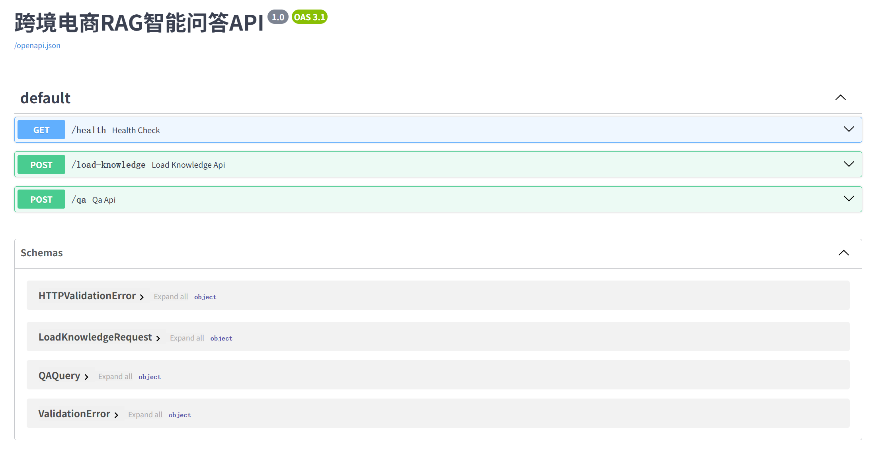
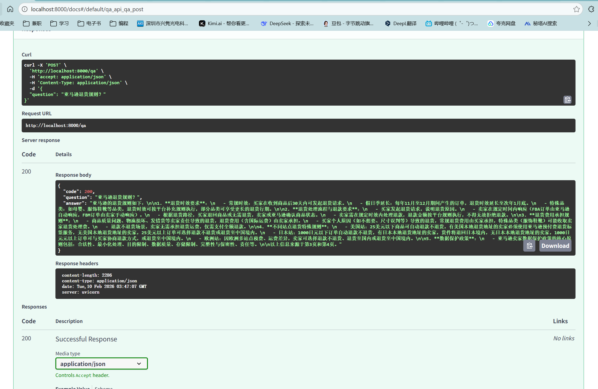
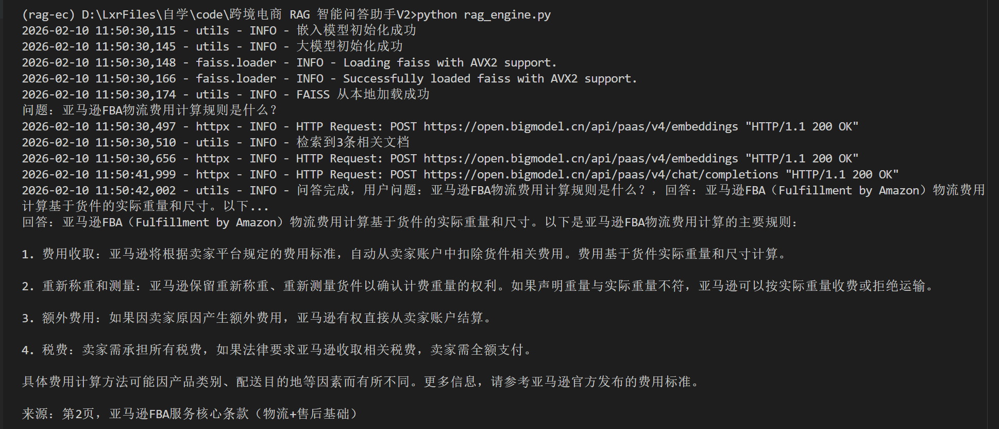

# 跨境电商 RAG 智能问答助手
基于 RAG（检索增强生成）实现的跨境电商领域智能问答系统，支持平台规则、物流政策、售后规范等知识库问答，提供 FastAPI 接口服务化部署。可扩展支持多模型、多文档、鉴权、限流、监控等生产特性

## 技术栈
- 后端：Python + FastAPI
- 大模型：智谱 AI GLM-4-Flash
- 向量库：FAISS（本地轻量部署）
- 框架：LangChain
- 部署：本地 Uvicorn

## 功能
- PDF 知识库自动加载、文本分块、向量化入库
- 向量检索 + 重排序 + 上下文引用（降低幻觉）
- 标准化 API 接口，支持业务系统对接
- 日志记录、异常处理、本地持久化

## 快速开始
### 1. 环境准备
```bash
conda create -n rag-ec python=3.10
conda activate rag-ec
pip install -r requirements.txt
```

### 2. 配置文件
新建 .env，填入智谱 API Key：
```ini
ZHIPU_API_KEY=your_api_key
```
### 3. 准备知识库
将跨境电商规则 PDF（如亚马逊 / 速卖通规则）放入根目录，命名为 amazon_rules.pdf。

### 4. 加载知识库
```bash
python rag_engine.py
# 首次运行取消 load_knowledge 注释，加载成功后注释
```
### 5. 启动服务
```bash
python api_server.py
```
### 6. 接口测试
健康检查：http://localhost:8000/health
问答接口：POST http://localhost:8000/qa
访问 Swagger 文档：http://localhost:8000/docs
```json
// POST /qa 请求体
{
  "question": "亚马逊FBA物流费用计算规则是什么？"
}
```


